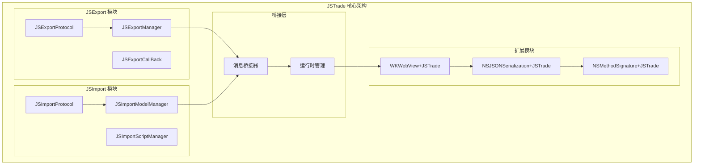
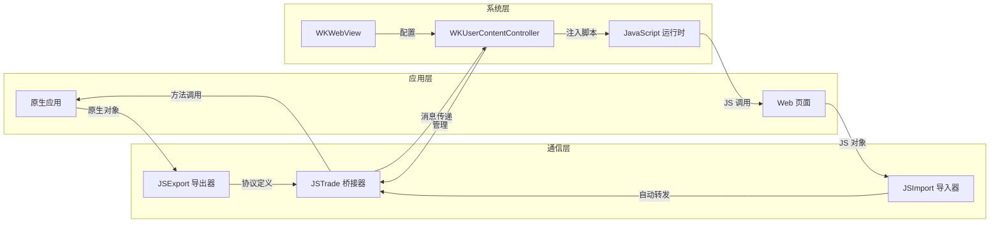
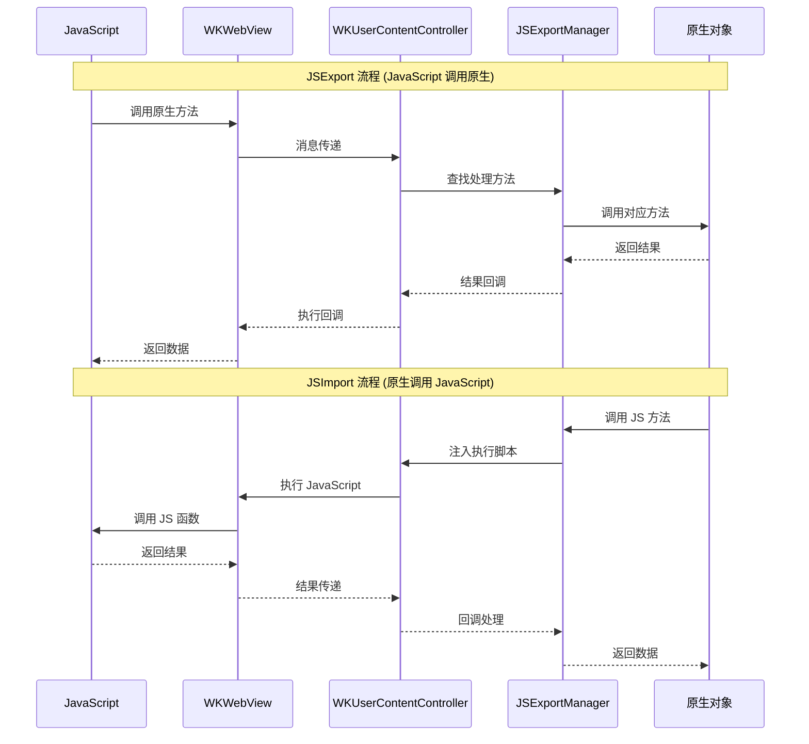

# JSTrade

[](https://travis-ci.org/youlianchun/JSTrade)
[](https://cocoapods.org/pods/JSTrade)
[](https://cocoapods.org/pods/JSTrade)
[](https://cocoapods.org/pods/JSTrade)

JSTrade 是一个专为 iOS WKWebView 设计的 JavaScript 与 Objective-C/Swift 双向通信框架，提供简洁易用的 API 来实现原生代码与 Web 页面的无缝交互。

## 功能特性

### 🚀 核心功能
- **双向通信**: 支持 JavaScript 调用原生方法，原生代码调用 JavaScript 函数
- **类型安全**: 自动处理基本数据类型、NSDictionary、NSArray、NSNumber、NSString 等
- **异步支持**: 内置异步调用机制，避免 JavaScript 执行锁问题
- **命名空间**: 支持自定义命名空间，避免全局污染
- **Block 支持**: 原生 Block 可直接导出为 JavaScript 函数

### 🔧 主要组件



- **JSExport**: 将原生对象和方法导出到 JavaScript 环境
- **JSImport**: 将 JavaScript 对象和方法导入到原生环境
- **WKWebView 扩展**: 提供便捷的 JavaScript 调用接口

## 实现原理

### 整体架构

JSTrade 采用分层架构设计，通过桥接模式实现 JavaScript 与原生代码的双向通信：



### JSExport 机制
JSTrade 通过以下方式实现原生对象到 JavaScript 的导出：

1. **协议驱动**: 使用 `JSExportProtocol` 协议定义可导出的方法
2. **消息桥接**: 通过 WKUserContentController 建立原生与 JavaScript 的通信桥梁
3. **自动映射**: 使用宏定义自动生成方法映射，支持参数重命名和回调处理

```objc
@protocol OCModelProtocol <JSExportProtocol>
-(int)func0;                                    // 无参有返回值
-(void)func1:(id)p;                             // 有参无返回值
-(void)func2:(JSExportCallBack)cb;              // 无参有回调
JSExportAs(func3,                               // 方法重命名
           -(void)func4:(int)p p2:(NSString*)p2 cb:(JSExportCallBack)cb
           );
@end
```

### JSImport 机制
JavaScript 对象导入原生环境的核心原理：

1. **属性映射**: 使用 `JSImportVar` 宏自动映射 JavaScript 属性
2. **方法转发**: 通过 `JSImportFunc` 宏实现方法自动转发
3. **命名空间**: 通过 `JSTradeImportSpaceNameSet` 设置访问命名空间

### 通信架构

#### 数据流向图



#### 组件关系图

```
JavaScript ←→ WKUserContentController ←→ JSExportManager ←→ 原生对象
    ↑              ↓
WKWebView ←→ 消息桥接层 ←→ 协议映射层
```

## 使用示例

### 1. 基础设置

```objc
#import <JSTrade/JSExportManager.h>

@interface ViewController ()
@property (nonatomic, strong) JSExportManager* jsExport;
@property (nonatomic, retain) WKWebView *webView;
@end

@implementation ViewController

- (void)setupWebView {
    WKWebViewConfiguration *configuration = [[WKWebViewConfiguration alloc] init];
    configuration.userContentController.jsExportManager = self.jsExport;
    
    self.webView = [[WKWebView alloc] initWithFrame:self.view.bounds configuration:configuration];
    [self.view addSubview:self.webView];
}

- (void)setupJSExport {
    // 导出原生模型对象
    self.jsExport[@"ocModel"] = [[OCModel alloc] init];
    
    // 导出 Block 函数
    self.jsExport[@"jsHandler"] = ^int(int i) {
        NSLog(@"收到参数: %d", i);
        return i * 2;
    };
    
    // 导出带回调的 Block
    self.jsExport[@"jsHandlerCB"] = ^(NSString *str, JSExportCallBack cb) {
        NSLog(@"收到字符串: %@", str);
        cb(@"回调数据");
    };
}
```

### 2. 原生对象导出

```objc
// OCModel.h
@protocol OCModelProtocol <JSExportProtocol>
-(int)func0;                                    // window.ocModel.func0()
-(void)func1:(id)p;                             // window.ocModel.func1(param)
-(void)func2:(JSExportCallBack)cb;              // window.ocModel.func2(callback)
JSExportAs(func3,                               // 重命名方法
           -(void)func4:(int)p p2:(NSString*)p2 cb:(JSExportCallBack)cb
           );
@end

// OCModel.m
@implementation OCModel
- (int)func0 {
    return 42;
}

- (void)func1:(id)p {
    NSLog(@"收到参数: %@", p);
}

- (void)func2:(JSExportCallBack)cb {
    cb(@"回调数据");
}

- (void)func4:(int)p p2:(NSString*)p2 cb:(JSExportCallBack)cb {
    NSString *result = [NSString stringWithFormat:@"p1=%d, p2=%@", p, p2];
    cb(result);
}
@end
```

### 3. JavaScript 调用原生方法

```html
<script>
// 调用无参有返回值方法
function callFunc0() {
    if (window.ocModel) {
        var result = window.ocModel.func0();
        alert("返回值: " + result);
    }
}

// 调用有参无返回值方法
function callFunc1() {
    if (window.ocModel) {
        window.ocModel.func1("测试参数");
    }
}

// 调用带回调的方法
function callFunc2() {
    if (window.ocModel) {
        window.ocModel.func2(function(param) {
            alert("回调数据: " + param);
        });
    }
}

// 调用重命名方法
function callFunc3() {
    if (window.ocModel) {
        window.ocModel.func3(10, "测试", function(result) {
            alert("结果: " + result);
        });
    }
}
</script>
```

### 4. 原生调用 JavaScript

```objc
// 调用 JavaScript 函数
id result = [self.webView jsFunc:@"jsModel.sum" arguments:@[@10, @20]];

// 获取 JavaScript 属性
id strValue = [self.webView jsGetVar:@"jsModel.str"];

// 设置 JavaScript 属性
[self.webView jsSetVar:@"jsModel.newValue" value:@"新值"];
```

### 5. JavaScript 对象导入

```objc
@protocol JSModelProtocol <JSImportProtocol>
JSImportVar(NSString *, str);
JSImportFunc(-(void)showMessage:(NSString*)message);
JSImportFunc(-(int)sum:(int)a b:(int)b);
@end

// 设置命名空间
JSTradeImportSpaceNameSet(jsModel, @"jsModel");
```

## 注意事项

### 性能优化
- **异步回调**: 在方法体内调用 JavaScript 时，建议使用 `[JSExportManager asyncCallJSAfterReturn:^{}]` 避免执行锁
- **页面重载**: 每次更新 JSExport 配置后需要重新加载页面

### 数据类型支持
- **支持**: 基本数据类型、NSDictionary、NSArray、NSNumber、NSString、nil
- **限制**: 复杂对象需要转换为 NSDictionary 或 NSArray

### 命名规范
- 使用 `JSExportAs` 宏避免方法名冲突
- 使用 `JSImportVarAs` 宏处理属性名大小写差异

## 安装要求

- iOS 8.0+
- Xcode 8.0+
- CocoaPods

## 安装方法

JSTrade 可通过 [CocoaPods](https://cocoapods.org) 安装，在 Podfile 中添加：

```ruby
pod 'JSTrade'
```

## 运行示例

1. 克隆项目仓库
2. 在 Example 目录下运行 `pod install`
3. 打开 `JSTrade.xcworkspace`
4. 选择 JSTrade-Example target 运行

## 作者

youlianchun, youlianchunios@163.com

## 许可证

JSTrade 基于 MIT 许可证开源，详见 LICENSE 文件。
